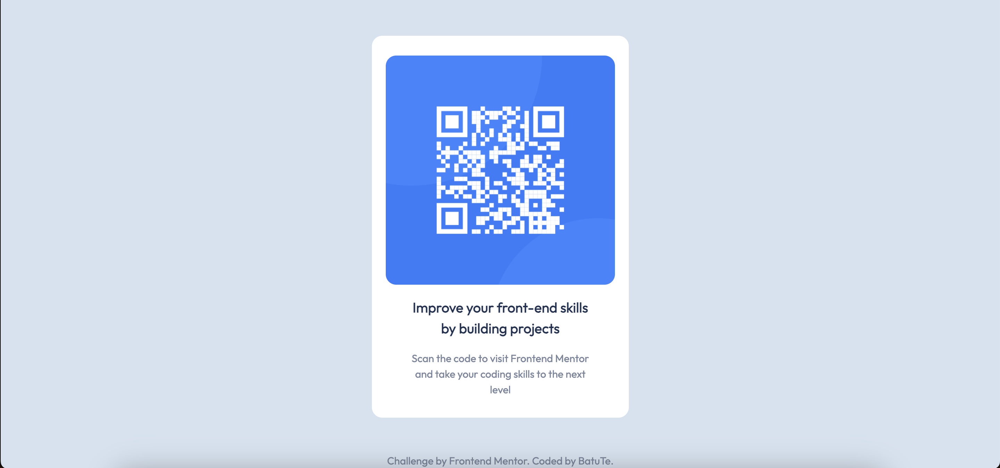

# Frontend Mentor - QR code component solution

This is a solution to the [QR code component challenge on Frontend Mentor](https://www.frontendmentor.io/challenges/qr-code-component-iux_sIO_H).

## Table of contents

- [Overview](#overview)
  - [Screenshot](#screenshot)
  - [Links](#links)
- [My process](#my-process)
  - [Built with](#built-with)
  - [What I learned](#what-i-learned)
  - [Continued development](#continued-development)
  - [Useful resources](#useful-resources)
- [Author](#author)
- [Acknowledgments](#acknowledgments)

## Overview

This was my first challange. The design includes an img and two paragraph of texts.

### Screenshot

This is the screenshot of my design.

### Links

- Solution URL: [Add solution URL here](https://your-solution-url.com)
- Live Site URL: [Add live site URL here](https://your-live-site-url.com)

## My process

Even if it was a simple html and css code, I tried to be organized and clean with my general organization. I created different folders for images and css stylesheet file. When I write html, I tried to use semantic html markup and I used utility classes on css design. I didn't use rem or em instead I used px for size and no media query was used bcs the design is not responsive.

The container that included the qr code image and the text was centered by using flexbox.

### Built with

- Semantic HTML5 markup
- CSS custom properties
- Flexbox

### What I learned

First time I've used utility classes, var and calc functions. First time I'm uploading my work to a public github repository.
